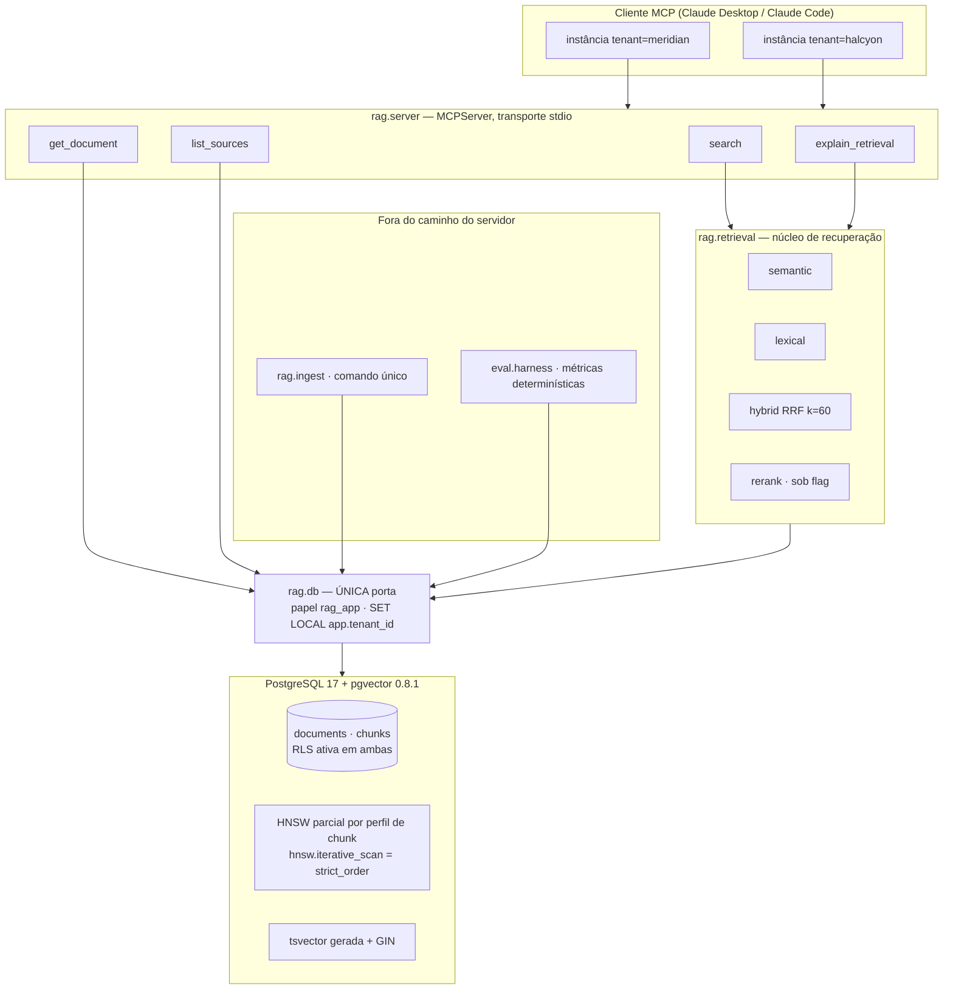

# RAG com Escopo de Tenant Design

**Spec**: `.specs/features/rag-com-escopo-de-tenant/spec.md`
**Context**: `.specs/features/rag-com-escopo-de-tenant/context.md`
**Status**: Approved
**Data**: 2026-08-20

Conforma-se a AD-001 a AD-005 (`.specs/STATE.md`). Nenhuma decisão ativa foi superada.

---

## Architecture Overview

Quatro camadas, com uma regra que atravessa todas: **a única porta para o banco é `rag.db`**, que abre
conexão com um papel sem `BYPASSRLS` e aplica `SET LOCAL app.tenant_id` antes de qualquer consulta.
Nenhum outro módulo abre conexão. É isso que torna o isolamento uma propriedade do sistema, e não uma
disciplina de quem escreve consulta.



**O que essa forma garante, requisito a requisito:**

- `search`, `get_document` e `list_sources` não têm caminho de código que alcance o banco sem passar
  pelo escopo — não por convenção, mas porque `rag.db` é o único lugar que constrói conexão (RAG-16).
- O harness de avaliação usa a mesma porta, também escopado. **Nenhum componente do projeto usa
  `BYPASSRLS`.** A linha de base de recall exigida pelo RAG-10 vem de um *segundo banco* carregado só
  com o corpus de um tenant, não de um privilégio elevado — comparar bancos em vez de elevar
  privilégio mantém a propriedade "não existe caminho privilegiado" verdadeira sem exceção.

---

## Code Reuse Analysis

Projeto greenfield: não há código anterior a reaproveitar. O que se reaproveita é padrão e biblioteca.

### Bibliotecas e padrões

| Componente | Origem | Como se usa |
| ---------- | ------ | ----------- |
| `mcp` v2 (`MCPServer`) | SDK oficial Python | Servidor stdio e declaração das quatro tools por decorador com type hints; o SDK gera o esquema |
| `pgvector` 0.8.1 | Extensão PostgreSQL | Tipo `vector(768)`, operador `<=>`, índice HNSW, `hnsw.iterative_scan` |
| `tsvector` / `ts_rank_cd` / GIN | PostgreSQL nativo | Ranking léxico sem subir um segundo serviço; o RRF vira uma CTE em SQL |
| `sentence-transformers` | Biblioteca | Carregamento local de `multilingual-e5-base` e de `bge-reranker-v2-m3` |
| `psycopg` 3 | Biblioteca | Conexão, `SET LOCAL` no escopo da transação, adaptação de tipos do pgvector |
| Disciplina `.specs/` | `suporte-sh3-hub`, `sh3-mcp-server` | Mesmo fluxo spec → design → tasks → verificação já em uso nos outros repositórios |

### Integration Points

| Sistema | Método de integração |
| ------- | -------------------- |
| Claude Desktop / Claude Code | Bloco de configuração no README declarando dois servidores, um por tenant, cada um com sua variável de ambiente |
| GitHub Actions | PostgreSQL como *service container* com a imagem `pgvector/pgvector:pg17`; a suíte de isolamento é gate obrigatório |
| `sh3-conhecimento` (futuro, outro repositório) | Nenhuma integração de código. O que atravessa é o desenho: o predicado RLS trocando `tenant_id` por `sistema × visibilidade` |

---

## Components

### `rag.db` — porta única de acesso

- **Purpose**: construir toda conexão com o papel correto e o escopo aplicado; nenhum outro módulo fala com o banco.
- **Location**: `src/rag/db.py`
- **Interfaces**:
  - `scoped_connection(tenant_id: str) -> ContextManager[Connection]` — abre transação, executa `SET LOCAL app.tenant_id`, devolve conexão já escopada
  - `resolve_tenant_from_env() -> str` — lê a variável de ambiente, valida contra a tabela de tenants, encerra o processo se ausente ou desconhecida (RAG-17)
- **Dependencies**: `psycopg`, configuração de ambiente
- **Reuses**: —

### `rag.chunking` — divisão sensível à estrutura

- **Purpose**: dividir documento por fronteira de seção quando há títulos markdown; por tamanho fixo com 15% de overlap quando não há.
- **Location**: `src/rag/chunking.py`
- **Interfaces**:
  - `split(text: str, profile: ChunkProfile) -> list[Chunk]` — `profile` é `P512` ou `P1024`
  - `has_structure(text: str) -> bool` — decide qual estratégia se aplica (RAG-03 / RAG-04)
- **Dependencies**: tokenizador do modelo de embedding, para contar tokens na mesma unidade
- **Reuses**: —

### `rag.embedding` — modelo local com os prefixos corretos

- **Purpose**: gerar vetores de 768 dimensões, sempre com o prefixo que o e5 exige.
- **Location**: `src/rag/embedding.py`
- **Interfaces**:
  - `embed_passages(texts: list[str]) -> list[Vector]` — prefixa `passage: ` (RAG-06)
  - `embed_query(text: str) -> Vector` — prefixa `query: ` (RAG-07)
- **Dependencies**: `sentence-transformers`, revisão do modelo fixada
- **Reuses**: —
- **Nota**: as duas funções são separadas de propósito. Uma função única com parâmetro de modo é
  exatamente o desenho em que alguém esquece o prefixo e ninguém percebe.

### `rag.ingest` — comando de carga idempotente

- **Purpose**: ler `corpus/`, dividir, embeddar e gravar, sem duplicar em execução repetida.
- **Location**: `src/rag/ingest.py`
- **Interfaces**:
  - `ingest(corpus_dir: Path, tenant_id: str, profile: ChunkProfile) -> IngestReport`
  - CLI: `uv run ingest corpus/ --tenant meridian --profile 512`
- **Dependencies**: `rag.db`, `rag.chunking`, `rag.embedding`
- **Reuses**: —

### `rag.retrieval` — os três modos

- **Purpose**: recuperar candidatos; nunca gerar resposta.
- **Location**: `src/rag/retrieval/{semantic,lexical,hybrid,rerank}.py`
- **Interfaces**:
  - `semantic.search(conn, query, top_k, profile) -> list[Candidate]` — ordena por `<=>`
  - `lexical.search(conn, query, top_k, profile) -> list[Candidate]` — ordena por `ts_rank_cd`
  - `hybrid.search(conn, query, top_k, profile) -> list[Candidate]` — RRF k=60 sobre as posições dos dois
  - `rerank.apply(query, candidates) -> list[Candidate]` — só sob flag (RAG-32)
  - Todos devolvem `Candidate` com scores e posições preservados — é o que alimenta `explain_retrieval`
- **Dependencies**: `rag.db`, `rag.embedding`
- **Reuses**: —

### `rag.server` — as quatro tools

- **Purpose**: expor a recuperação por MCP, sem nenhum parâmetro de escopo.
- **Location**: `src/rag/server.py`
- **Interfaces**:
  - `search(query: str, mode: Mode = "hybrid", top_k: int = 5)`
  - `get_document(doc_id: str)`
  - `list_sources()`
  - `explain_retrieval(query: str, mode: Mode = "hybrid")`
- **Dependencies**: `mcp` v2, `rag.retrieval`, `rag.db`
- **Reuses**: —

### `eval` — harness e ablação

- **Purpose**: calcular métricas determinísticas e emitir a tabela do README.
- **Location**: `src/eval/{harness,metrics,ablation}.py`
- **Interfaces**:
  - `metrics.recall_at_k / precision_at_k / mrr / ndcg_at_k` — funções puras sobre listas de ids
  - `harness.run(golden_set, config) -> RunResult`
  - `ablation.run_matrix() -> str` — 3 modos × 2 rerank × 2 perfis = 12 execuções, saída em markdown
- **Dependencies**: `rag.retrieval`, `rag.db`, golden set versionado
- **Reuses**: —

---

## Data Models

Duas tabelas. `tenant_id` fica **desnormalizado em `chunks`** de propósito: se a política RLS de
`chunks` precisasse de junção com `documents` para descobrir o tenant, o predicado ficaria ainda mais
longe de ser empurrado para perto do índice, agravando o problema do RAG-10.

```sql
CREATE TABLE tenants (
    id          text PRIMARY KEY,
    nome        text NOT NULL
);

CREATE TABLE documents (
    id             uuid PRIMARY KEY,
    tenant_id      text NOT NULL REFERENCES tenants(id),
    source_path    text NOT NULL,
    titulo         text NOT NULL,
    categoria      text NOT NULL,
    versao         text NOT NULL,
    visibilidade   text NOT NULL,     -- vocabulário alinhado ao destino, ver Tech Decisions
    content_hash   text NOT NULL,
    texto_original text NOT NULL,     -- preservado para auditoria (RAG-24)
    created_at     timestamptz NOT NULL DEFAULT now(),
    UNIQUE (tenant_id, source_path, content_hash)
);

CREATE TABLE chunks (
    id           uuid PRIMARY KEY,
    document_id  uuid NOT NULL REFERENCES documents(id) ON DELETE CASCADE,
    tenant_id    text NOT NULL REFERENCES tenants(id),   -- desnormalizado: ver acima
    profile      text NOT NULL,                          -- 'P512' | 'P1024'
    ord          int  NOT NULL,
    texto        text NOT NULL,
    embedding    vector(768) NOT NULL,
    fts          tsvector GENERATED ALWAYS AS (
                     to_tsvector('english', immutable_unaccent(texto))
                 ) STORED
);
```

**Relacionamentos**: `chunks.document_id → documents.id`; ambas escopadas por `tenant_id`.

### Índices

```sql
-- Um índice HNSW parcial por perfil de chunk.
-- Sem isso, 'profile' seria um segundo filtro pós-varredura empilhado sobre o de RLS,
-- e a mitigação do RAG-10 teria que absorver os dois ao mesmo tempo.
CREATE INDEX chunks_hnsw_p512  ON chunks USING hnsw (embedding vector_cosine_ops) WHERE profile = 'P512';
CREATE INDEX chunks_hnsw_p1024 ON chunks USING hnsw (embedding vector_cosine_ops) WHERE profile = 'P1024';
CREATE INDEX chunks_fts_gin    ON chunks USING gin (fts);
CREATE INDEX chunks_tenant     ON chunks (tenant_id, profile);
```

Com os índices parciais por perfil, **o predicado de RLS sobre `tenant_id` é o único filtro que
sobra depois da varredura do índice** — que é exatamente o caso que o `hnsw.iterative_scan` foi feito
para resolver, e o que o RAG-10 mede.

### Papéis e políticas

Três papéis, com fronteiras que são elas próprias parte da prova:

| Papel | Usado por | Poderes |
| ----- | --------- | ------- |
| `rag_owner` | migrações e **somente** a fixture do teste-canário | dono das tabelas — ignora RLS por padrão, por isso nunca é usado em execução normal |
| `rag_ingest` | comando de ingestão | `INSERT`/`UPDATE`/`DELETE` sujeitos a `WITH CHECK` de tenant |
| `rag_app` | servidor MCP e harness de avaliação | `SELECT` apenas, `NOBYPASSRLS`, não é dono de nada |

```sql
ALTER TABLE documents ENABLE ROW LEVEL SECURITY;
ALTER TABLE chunks    ENABLE ROW LEVEL SECURITY;

CREATE POLICY tenant_read ON chunks FOR SELECT
    USING (tenant_id = current_setting('app.tenant_id', true));

CREATE POLICY tenant_write ON chunks FOR INSERT
    WITH CHECK (tenant_id = current_setting('app.tenant_id', true));
```

A política de escrita não é decorativa: **a ingestão fica incapaz de gravar um chunk no tenant
errado**, mesmo com um bug no código Python. Reforça RAG-14 sem ampliar escopo.

---

## Error Handling Strategy

| Cenário | Tratamento | O que a pessoa vê |
| ------- | ---------- | ----------------- |
| Variável de ambiente de tenant ausente ou desconhecida | Encerra na inicialização, antes de anunciar tools (RAG-17) | O cliente MCP mostra o servidor como indisponível, com a causa no log |
| Banco inacessível durante chamada de tool | Erro MCP identificando falha de conexão; processo permanece vivo (RAG-22) | Mensagem de erro na conversa; a próxima chamada tenta de novo |
| `top_k` fora de 1–50, `query` vazia, `mode` inválido | Validação no SDK pelos type hints, antes de qualquer consulta (RAG-11 a RAG-13) | Erro de validação com o valor aceito |
| `doc_id` inexistente **ou** fora do escopo | Mesma resposta "não encontrado" nos dois casos (RAG-25) | Indistinguível — a tool não vira oráculo de existência |
| Consulta sem nenhum resultado no escopo | Lista vazia | Vazio explícito, nunca o chunk menos ruim |
| Arquivo do corpus falha na ingestão | Registra caminho e causa, prossegue, sai com código ≠ 0 (RAG-05) | Relatório ao fim com o que entrou e o que falhou |
| Modelo ausente no cache local | Baixa informando progresso; sem rede, falha explícita | Mensagem dizendo qual modelo e por quê |
| Flag de rerank ativa e modelo ausente | Falha explícita, nunca devolve a ordem não reordenada (RAG-34) | Erro dizendo que o rerank foi pedido e não pôde ser aplicado |

---

## Risks & Concerns

| Concern | Onde | Impacto | Mitigação |
| ------- | ---- | ------- | ---------- |
| Dono de tabela **ignora RLS** por padrão no PostgreSQL | migração de papéis | A política existiria e não valeria nada; a tese do projeto seria falsa sem ninguém notar | Três papéis separados; teste que afirma que `rag_app` não é dono e não tem `BYPASSRLS`; `rag_owner` só aparece na fixture do canário |
| `unaccent()` é `STABLE`, não `IMMUTABLE` — coluna gerada **rejeita** a chamada direta | DDL de `chunks.fts` | A migração falha, ou alguém "resolve" removendo o `unaccent` e a busca léxica passa a errar em acento silenciosamente | Função `immutable_unaccent` embrulhando a chamada, criada na mesma migração, com teste de busca acentuada |
| `iterative_scan` pode não fechar a recall exigida pelo RAG-10 | camada semântica | A busca com escopo devolve menos que `top_k` e a manchete do README fica errada | RAG-10 é teste, não expectativa: mede contra banco de tenant único. Plano B registrado: índice HNSW parcial por tenant, ao custo de deixar de generalizar para o destino |
| Golden set e corpus são trabalho de **escrita**, não de código — a estimativa de origem atribui a eles ~30% do esforço, e é onde projetos assim morrem | fases 1 e 6 | Projeto trava com toda a engenharia pronta e nenhum número para publicar | Corpus e golden set entram como as primeiras tasks, antes da recuperação; a suíte de isolamento reaproveita o golden set em vez de exigir escrita nova |
| Download do modelo em CI é lento e instável | GitHub Actions | Suíte vermelha por rede, não por regressão — e suíte que falha à toa deixa de ser lida | Revisão do modelo fixada e cache do runner; testes que não dependem de embedding usam vetor determinístico de fixture |
| Suíte de isolamento verde pode ser vacuosa | `tests/isolation/` | O README afirmaria zero vazamento sem que o teste soubesse detectar vazamento | RAG-19: o canário remove a política em banco descartável e exige que a suíte fique vermelha |
| `user.email` global aponta para a conta de trabalho | `~/.gitconfig` desta máquina | Todo commit do repositório público atribuído à conta da empresa, expondo o nome dela no histórico | Primeira task do projeto, antes do commit inicial: `git config user.email` local. Verificado hoje: o global é `168448310+saracristina-sh3@users.noreply.github.com` |

---

## Tech Decisions

| Decisão | Escolha | Racional |
| ------- | ------- | -------- |
| Estratégia de índice sob escopo | Índice HNSW único + RLS + `hnsw.iterative_scan = strict_order` | Aprovado na discussão. Generaliza para o destino sem tocar em índice; `strict_order` preserva a ordem exata por distância, que é o que alimenta as posições do RRF — `relaxed_order` daria recall melhor com ordem levemente errada, e fica como candidato a linha extra da ablação |
| Perfis de chunk coexistindo | Coluna `profile` + um índice HNSW **parcial por perfil** | Mantém o filtro de perfil resolvido pelo próprio índice, deixando o predicado de RLS como o único filtro pós-varredura — que é o que a mitigação do RAG-10 precisa absorver |
| `tenant_id` em `chunks` | Desnormalizado | Política RLS que exigisse junção afastaria ainda mais o predicado do índice |
| Linha de base de recall | Segundo banco carregado com um tenant só | Permite medir o RAG-10 **sem** nenhum papel com `BYPASSRLS` — preserva a propriedade "não existe caminho privilegiado" sem exceção |
| Separação `embed_query` / `embed_passages` | Duas funções, não um parâmetro de modo | O prefixo do e5 é a classe de erro que não dá sintoma: some recall e nada quebra |
| Vocabulário de `visibilidade` | `empresa`, `departamentos`, `equipes`, `restrito` — gravado mas **não aplicado** neste escopo | É o eixo que o `sh3-conhecimento` vai usar (`modulo-conhecimento.md:274`). Gravar desde já custa uma coluna; divergir depois custa reescrever o corpus |
| Política de escrita na ingestão | `WITH CHECK` de tenant no `INSERT` | Torna impossível gravar chunk no tenant errado mesmo com bug na aplicação |
| Servidor stdio, um processo por tenant | Configuração declara dois servidores | Consequência direta da AD-003 |

> Nenhuma decisão desta tabela estabelece convenção para features futuras deste repositório além do
> que AD-001 a AD-005 já cobrem — nada a acrescentar em `.specs/STATE.md`.
