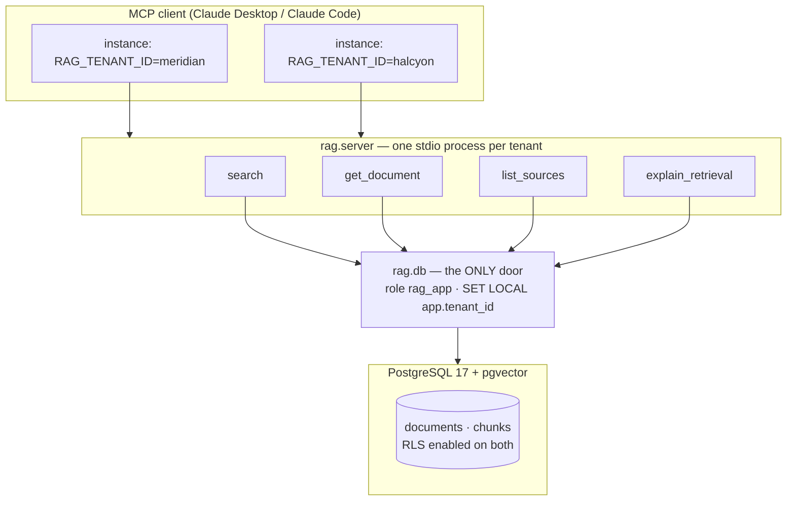

# tenant-scoped-rag

There are thousands of repositories called `rag-example`: ingest, embed, top-k, answer. None of
them prove anything, because anyone with a free weekend can build the same thing. What almost
nobody builds is retrieval where the asker's permission is part of the query itself, instead of a
filter bolted on afterward.

This repository is a lab for that one decision. Two fictional SaaS knowledge bases —
`meridian` (a CRM) and `halcyon` (a billing platform) — share one PostgreSQL database, one vector
index, one set of tables. Nothing in the application code decides who sees what. **The database
does**, via row-level security anchored on `current_setting('app.tenant_id')`, enforced by a
database role that owns nothing and can bypass nothing. The claim isn't "our `WHERE` clauses are
correct" — it's "the database refuses," and a test suite proves it, including a canary that
deliberately breaks isolation to confirm the suite would actually catch it if it ever happened for
real.

## Headline numbers

**Zero leakage across 180 cross-tenant queries** — every one of the 60 hand-written golden-set
questions (30 per tenant), run under the *other* tenant's identity, in all three search modes
(semantic, lexical, hybrid). `tests/isolation/test_cross_tenant.py` is the proof; a canary in
`tests/isolation/test_canary.py` disables the RLS policy on a disposable database and asserts the
isolation suite goes red — because a suite that can't detect a leak is worse than no suite at all.

**recall@5 by configuration**, computed deterministically over the golden set (`uv run rag-eval`
runs the two-tenant summary; the table below is the full ablation matrix — `mode × rerank ×
chunk profile`):

| Mode | Chunk profile | Rerank | recall@5 | precision@5 | MRR | nDCG@10 |
| --- | --- | --- | --- | --- | --- | --- |
| semantic | 512 | off | 1.000 | 0.200 | 0.989 | 0.992 |
| semantic | 512 | on  | 1.000 | 0.200 | 0.988 | 0.991 |
| semantic | 1024 | off | 1.000 | 0.200 | 0.989 | 0.992 |
| semantic | 1024 | on  | 1.000 | 0.200 | 0.988 | 0.991 |
| lexical | 512 | off | 0.183 | 0.183 | 0.183 | 0.183 |
| lexical | 512 | on  | 0.183 | 0.183 | 0.183 | 0.183 |
| lexical | 1024 | off | 0.183 | 0.183 | 0.183 | 0.183 |
| lexical | 1024 | on  | 0.183 | 0.183 | 0.183 | 0.183 |
| hybrid | 512 | off | 1.000 | 0.200 | 0.989 | 0.992 |
| hybrid | 512 | on  | 1.000 | 0.200 | 0.988 | 0.991 |
| hybrid | 1024 | off | 1.000 | 0.200 | 0.989 | 0.992 |
| hybrid | 1024 | on  | 1.000 | 0.200 | 0.988 | 0.991 |

Averaged over both tenants' 30-question golden sets, precision@5 = 0.200 wherever recall@5 = 1.000
because each question is annotated against exactly one relevant document, so a perfect recall run
retrieves it once among five slots. Two things worth reading past the numbers:

- **Lexical alone is a weak baseline here on purpose.** The golden-set questions are phrased as a
  user would ask them ("why would someone keep seeing a workspace-not-found error"), not as the
  keywords the article uses — that gap is exactly what semantic search is for, and hybrid inherits
  semantic's strength because RRF only needs one ranking to place a document highly.
- **Reranking made things marginally worse, not better**, on this corpus (MRR 0.989 → 0.988,
  nDCG@10 0.992 → 0.991). It's real evidence, not a rounding artifact: `bge-reranker-v2-m3` is a
  general-purpose cross-encoder, not tuned for this domain, and it's the kind of result the
  ablation table exists to surface instead of hide. Reranking stays off by default (see
  `RAG_RERANK_ENABLED` below) — this repository doesn't ship a knob that measurably hurts.

Reproduce every number above from a clean clone: `uv run rag-eval` for the per-tenant summary,
or `uv run python -c "from eval.ablation import run_matrix; print(run_matrix())"` for the full
table. Both are deterministic — no LLM judge, no external API, same golden set every time.

## How isolation actually works



- **The tenant identity never travels as a tool argument.** It is read once, from an environment
  variable, when the server process starts (`RAG_TENANT_ID`). None of the four MCP tools —
  `search`, `get_document`, `list_sources`, `explain_retrieval` — accepts anything resembling a
  scope parameter. A client has no argument to forge because none exists.
- **`rag.db` is the only module that opens a database connection.** Every query runs as `rag_app`,
  a role that is `NOBYPASSRLS`, owns no table, and has no `INSERT`/`UPDATE`/`DELETE` grant on the
  corpus tables at all. Row-level security policies on `documents` and `chunks` compare
  `tenant_id = current_setting('app.tenant_id')`, and that setting is applied via `SET LOCAL`
  inside the same transaction as the query — there is no code path that reaches the corpus tables
  without it.
- **The write path is just as locked down.** `rag_ingest`'s `INSERT` policy carries a `WITH CHECK`
  on `tenant_id`, so a bug in the ingestion script cannot land a chunk under the wrong tenant even
  if it tried — the database rejects the write, not the application.
- **Lexical search uses `ts_rank_cd`, not BM25.** PostgreSQL's built-in text search ranks by
  tf-idf with length normalization; it does not implement Okapi BM25's term-frequency saturation.
  Calling it BM25 would be a factual error, so this README doesn't. An external extension
  (`pg_search` / ParadeDB) would get closer to real BM25 at the cost of another infrastructure
  dependency — out of scope for a repository whose point is "clone and run."
- **Hybrid search fuses by rank, not by score.** Cosine distance and `ts_rank_cd` live on
  incompatible scales; summing them would need an arbitrary normalization. Reciprocal Rank Fusion
  (k=60) only ever looks at *where* a candidate sits in each ranking, which sidesteps the scale
  problem entirely.

## Quickstart (under ten minutes, no API key)

```bash
git clone <this-repo> && cd tenant-scoped-rag
docker compose up -d          # PostgreSQL 17 + pgvector, two databases
uv sync                       # installs mcp, psycopg, pgvector, sentence-transformers, ...

# Apply migrations to the main database (idempotent - safe to re-run)
uv run python -c "
from pathlib import Path
import psycopg
dsn = 'host=localhost port=55432 dbname=rag user=postgres password=postgres'
with psycopg.connect(dsn, autocommit=True) as conn:
    for path in sorted(Path('migrations').glob('*.sql')):
        conn.execute(path.read_text())
"

# Ingest both tenants' corpora (first run downloads the local embedding model)
uv run ingest corpus/meridian --tenant meridian --profile 512
uv run ingest corpus/halcyon  --tenant halcyon  --profile 512
```

That's the whole setup: no API key, no account, no cloud service. The embedding model
(`multilingual-e5-base`) and, if you turn reranking on, the reranking model
(`bge-reranker-v2-m3`) run locally and are cached after their first download.

## Connect a client

Each tenant gets its own MCP server *instance* — identity is a property of the process, not of a
request. Point `command`/`args` at your clone's absolute path.

**Claude Desktop** (`claude_desktop_config.json`) and **Claude Code** (`.mcp.json`) read the same
shape:

```json
{
  "mcpServers": {
    "rag-meridian": {
      "command": "uv",
      "args": ["run", "--directory", "/absolute/path/to/tenant-scoped-rag", "rag-server"],
      "env": { "RAG_TENANT_ID": "meridian" }
    },
    "rag-halcyon": {
      "command": "uv",
      "args": ["run", "--directory", "/absolute/path/to/tenant-scoped-rag", "rag-server"],
      "env": { "RAG_TENANT_ID": "halcyon" }
    }
  }
}
```

Restart the client, ask something a `meridian` article covers (e.g. "why would a workspace
suddenly show a login error after a rebrand?"), and the answer comes from `meridian`'s corpus only
— ask the same question against the `rag-halcyon` server and it has no idea what you're talking
about, because `halcyon` sells billing software, not a CRM.

## The four tools

| Tool | What it does | What it can't do |
| --- | --- | --- |
| `search(query, mode, top_k)` | Semantic, lexical or hybrid retrieval over the active tenant's chunks | Accept a tenant/scope argument — there isn't one |
| `get_document(doc_id)` | Returns a document's full original text and metadata | Distinguish "wrong tenant" from "doesn't exist" — both produce the identical not-found response |
| `list_sources()` | Lists the active tenant's documents with chunk counts | Reveal anything about the other tenant, including that it exists |
| `explain_retrieval(query, mode)` | Per-candidate score, rank, fused position and cutoff reason | Leak a count, id or hint about any candidate outside the active scope |

## Configuration

| Environment variable | Default | Meaning |
| --- | --- | --- |
| `RAG_TENANT_ID` | *(required)* | Which tenant this server process serves. Missing/unknown → the process exits before announcing a single tool. |
| `RAG_DB_HOST` / `RAG_DB_PORT` / `RAG_DB_NAME` | `localhost` / `55432` / `rag` | Where the main database lives |
| `RAG_APP_PASSWORD` | `rag_app` | Password for the read-only role the server connects as |
| `RAG_RERANK_ENABLED` | off | Turn on `bge-reranker-v2-m3` reranking. Off by default because it measurably didn't help — see the ablation table |

## Running the test suites

```bash
uv run pytest tests/unit -q                              # domain logic, corpus/golden-set integrity
uv run pytest tests/integration -q                        # schema, RLS, retrieval, server tools
uv run pytest tests/isolation -q                           # 180 cross-tenant queries + the RLS canary
uv run ruff check . && uv run ruff format --check .        # lint / format
```

CI (`.github/workflows/ci.yml`) runs all of the above against a fresh `pgvector/pgvector:pg17`
service container on every push, with the isolation suite as an unconditional, obligatory gate —
if it fails, the workflow fails.

## What this repository deliberately does not do

No answer generation (the MCP client generates; this server only retrieves), no RAGAS or
LLM-judge metrics (they require an API key, which breaks "clone and run"), no real SH3 or customer
data anywhere, no HTTP/SSE transport, no multi-user-per-process auth, no rate limiting. This is a
retrieval architecture experiment, not a product. See `.specs/features/rag-com-escopo-de-tenant/spec.md`
for the full list and the reasoning behind each exclusion.
